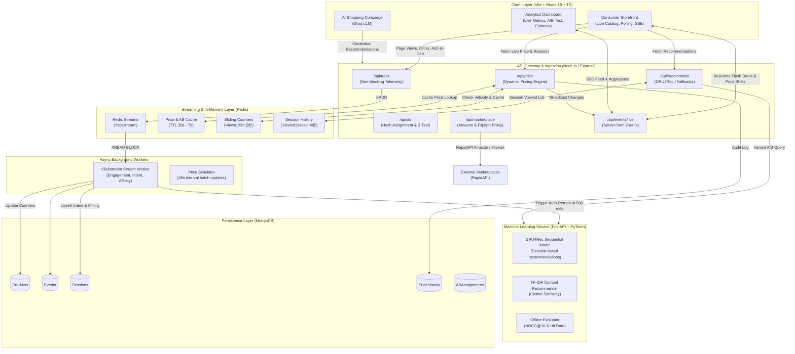

# PriceIQ ⚡ — Real-Time Dynamic Pricing & Session-Aware Personalization Engine

> **Tic-Tech-Toe Hackathon — Problem Statement 3**  
> *Next-Generation E-Commerce Intelligence: High-Frequency Event Ingestion, Dynamic Pricing, Deep-Learning Recommendations, and Real-Time Operational Telemetry.*

[](https://react.dev/)
[](https://www.typescriptlang.org/)
[](https://vitejs.dev/)
[](https://tailwindcss.com/)
[](https://nodejs.org/)
[](https://expressjs.com/)
[](https://redis.io/)
[](https://www.mongodb.com/)
[](https://fastapi.tiangolo.com/)
[](https://pytorch.org/)
[](LICENSE)

---

## 📌 Executive Summary

Traditional e-commerce platforms rely on static catalogue pricing and batch-processed recommendation grids that fail to capture intra-session user intent or sudden velocity shifts in inventory and demand.

**PriceIQ** is a full-stack, enterprise-grade e-commerce intelligence system developed for **Problem Statement 3 (Dynamic Pricing & Personalization Engine)**. It features:
1. **Sub-second Clickstream Processing** via non-blocking telemetry and Redis stream workers.
2. **Rule & Velocity-Driven Dynamic Pricing** bounded by strict business floors (≥ 70% MRP) and ceilings (≤ 100% MRP).
3. **Session-Aware Recommender System** pairing an offline/online **PyTorch GRU4Rec** sequential model with item-item co-view collaborative filtering and TF-IDF content fallbacks.
4. **Live A/B Testing Engine** tracking Conversion Rate (CR) and Average Order Value (AOV) with automated **Two-Proportion Z-Test statistical significance** calculations.
5. **Algorithmic Fairness & Transparency** auditing: zero demographic profiling, explicit reason disclosures ("Why this price?"), and non-demographic behavioral segmentation.
6. **Unified Dual-Source Marketplace** ingesting live Amazon & Flipkart products via RapidAPI with resilient cross-restart caching and local catalogue fallbacks.
7. **Real-Time Operations Dashboard** rendering live Server-Sent Events (SSE), API P99 latency tracking, NDCG@10 / Hit Rate evaluation scores, and predictive inventory stock-out forecasting.

---

## 🏛️ System Architecture



---

## ⚡ Core Modules & Technical Deep-Dive

### 1. Real-Time Event Processing & Telemetry
- **Non-blocking Tracking (`POST /api/track`)**: Dispatches client interactions (`page_view`, `search`, `wishlist_add`, `add_to_cart`, `remove_from_cart`, `purchase`) instantly without degrading storefront responsiveness.
- **Redis Streams & Decoupled Workers**: High-frequency clickstream messages are appended to the `clickstream` Redis Stream (`XADD`) and processed by `streamWorker.js` via `XREAD BLOCK`.
- **Session Intelligence**: On each event, sessions are enriched with:
  - **Weighted Engagement Score**: `page_view` (1), `search` (2), `wishlist_add` (2), `add_to_cart` (3), `purchase` (5).
  - **Purchase Intent Probability**: Aggregated ratio derived from cart additions, wishlists, views, and historical checkouts:
    $$\text{Intent} = \min\left(1.0, \, 0.30 \cdot \text{CartAdds} + 0.15 \cdot \text{Wishlist} + 0.03 \cdot \text{Views} + 0.50 \cdot \text{Purchases}\right)$$
  - **Category Affinity Mapping**: Tracks category view frequencies directly in the session document.

### 2. Algorithmic Dynamic Pricing Engine
Located at `backend/src/services/pricingEngine.js`, the pricing calculation enforces deterministic rules based on real-time market pressure:
1. **Inventory Scarcity Urgency**:
   - Critical stock ($\le 3$ units) with replenishment $> 7$ days: **$+20\%$ uplift**
   - Low stock ($\le 5$ units): **$+12\%$ uplift**
2. **Demand Velocity**:
   - High velocity ($\ge 30$ views in 15-minute sliding window): **$+15\%$ surge**
   - Moderate velocity ($\ge 15$ views in 15-minute sliding window): **$+8\%$ surge**
3. **Behavioral Surge Combo**:
   - Critical stock ($\le 3$) **and** high velocity ($\ge 20$ views): **$+22\%$ uplift**
4. **Competitor Price Matching**:
   - Monitors competitor price feeds (cached in Redis with 15-minute TTL); if competitor price drops below standard, targets a **5% undercutting match**.
5. **Willingness-to-Pay (Value Seeker segment)**:
   - Sessions classified as `value_seeker` receive a **$3\%$ relief discount** on standard catalogue items.
6. **Hard Guardrails (Regulatory & Brand Compliance)**:
   $$\text{Price}_{\text{final}} = \min\left(\text{MRP}, \, \max\left(\text{MRP} \times 0.70, \, \text{Price}_{\text{computed}}\right)\right)$$
   Every price calculation emits an immutable human-readable `priceReason` (`"Limited Stock"`, `"High Demand"`, `"Competitor Match"`, `"Standard Price"`).

### 3. Session-Aware & Deep Learning Recommendations
Located at `ml-service/` and `backend/src/services/recommendService.js`:
- **PyTorch GRU4Rec**: A Gated Recurrent Unit neural network trained on clickstream sequences to predict the next-item interaction given intra-session context.
- **Collaborative Co-View Matrix**: Item-to-item recommendation calculated from pairwise user session co-occurrences in the MongoDB `Event` repository.
- **Content-Based Fallback (TF-IDF + Cosine Similarity)**: Vectorizes product titles, descriptions, and categories to supply relevant alternatives for cold-start sessions.
- **Contextual Fallback**: When zero interaction history exists, cold-start falls back to category-popularity trends.

### 4. Enterprise A/B Testing & Statistical Significance
- **Deterministic Assignment**: Consistent SHA-256 hash modulo mapping per user ID (`abService.js`), cached in Redis for 7 days.
  - **Variant A (Control)**: Standard flat catalogue pricing + Rule-based recommendations.
  - **Variant B (Treatment)**: Real-time dynamic pricing + GRU4Rec machine-learning recommendations.
- **Two-Proportion Z-Test Engine**:
  Computes conversion rates ($p_1, p_2$), pooled probability ($p$), and standard error ($SE$):
  $$Z = \frac{p_2 - p_1}{\sqrt{p(1-p)\left(\frac{1}{n_1} + \frac{1}{n_2}\right)}}$$
  Calculates the two-tailed Gaussian $p$-value and flags statistical significance in the admin dashboard once $p < 0.05$ with sufficient sample sizes ($n \ge 30$).

### 5. Algorithmic Fairness & Ethical Pricing Statement
PriceIQ implements an audited, ethical dynamic pricing policy visible in the admin dashboard:
- **Strictly Excluded Demographic Factors**: User location, IP address, device model/OS, demographic indicators, and browsing history outside the platform are strictly isolated and **never** fed into price generation.
- **Permitted Commercial Factors**: Only commercial and supply-demand signals are evaluated: current inventory depth, 15-minute demand velocity, supplier restock delays, and competitor public pricing.
- **Consumer Transparency**: Every product card and product detail view displays a **"Why this price?"** disclosure badge, explaining the exact rationale behind any price fluctuation.

### 6. Live Operations & Telemetry Dashboard
- **Real-Time KPIs**: Total Tracked Revenue, Conversion Rate (Overall vs. Control vs. Treatment), Average Order Value (AOV), Live Active Sessions (5-min sliding window), Cart Adds, Purchases, Wishlist Adds.
- **Operational Health**:
  - **P99 / P50 API Latency**: Monitored via Express latency middleware.
  - **Recommender Model Metrics**: Live NDCG@10 and Hit Rate reported directly from the ML service.
  - **Predictive Inventory Table**: Stock-out forecast projecting daily purchase velocity and estimating exact days until inventory hits zero.
- **SSE Real-Time Feed**: Live event ticker streaming every price change, add-to-cart, and completed purchase in real-time.

---

## 📂 Project Directory Structure

```
tic_tech_toe-ecommerce-website-/
├── README.md                           # Root documentation
├── docs/                               # Audits and architectural specs
│   ├── problem-statement-3-gap-audit.md
│   └── live-marketplace-data-audit.md
├── backend/                            # Express.js REST API & Streaming Engine
│   ├── server.js                       # Server entrypoint & background cron simulation
│   ├── package.json
│   ├── .env.example
│   └── src/
│       ├── app.js                      # Express app setup, CORS, and route mounting
│       ├── config/                     # MongoDB & Redis (Upstash/Local) connections
│       ├── data/seed.js                # Database seeder (catalogue & historical events)
│       ├── middleware/                 # Request logger, latency tracer, error handlers
│       ├── models/                     # Mongoose models (Product, Event, Session, etc.)
│       ├── routes/                     # Modular API endpoints (price, track, recommend, etc.)
│       ├── services/                   # Pricing engine, analytics, A/B testing, recommendations
│       └── workers/                    # Redis stream worker (streamWorker.js)
├── frontend/                           # React 18 + TypeScript + Vite Storefront
│   ├── package.json
│   ├── vite.config.ts
│   ├── tailwind.config.ts
│   ├── README.md                       # Dedicated frontend guide
│   └── src/
│       ├── App.tsx                     # React Router routes & providers
│       ├── api/index.ts                # Typed API client & SSE EventSource listener
│       ├── components/                 # UI components (Navbar, ProductCard, PriceBadge, Chat)
│       ├── contexts/                   # ProductContext, AuthContext
│       └── pages/                      # Home, ProductDetail, Cart, Dashboard, SearchResults
└── ml-service/                         # Python FastAPI Machine Learning Microservice
    ├── main.py                         # FastAPI routes & lifecycle management
    ├── requirements.txt
    ├── gru_model.py                    # PyTorch GRU4Rec session recommendation model
    ├── recommender.py                  # TF-IDF content-based similarity engine
    ├── eval.py                         # NDCG@10 and Hit Rate offline evaluation
    └── seed_events.py                  # Synthetic event generation for model training
```

---

## 🛠️ Tech Stack Matrix

| Domain | Technology | Purpose |
|---|---|---|
| **Frontend Framework** | React 18 + TypeScript | Component architecture & typed UI state |
| **Build Tooling** | Vite 5 | Instant HMR and optimized production bundles |
| **Styling & UI** | Tailwind CSS + Radix UI + Lucide | Design system, accessible primitives, and micro-interactions |
| **Data Visualization** | Recharts | Responsive time-series charts and A/B comparison bars |
| **Backend Runtime** | Node.js (v20+) + Express | High-throughput asynchronous REST gateway |
| **In-Memory & Cache** | Redis (Upstash / In-Memory) | Redis Streams, 15-min velocity keys, 30s price caching |
| **Primary Database** | MongoDB Atlas / Local (Mongoose) | Documents for Products, Events, Sessions, PriceHistory |
| **ML Engine** | Python 3.10+ & FastAPI | Microservice serving GRU4Rec & TF-IDF recommendations |
| **Deep Learning** | PyTorch & Scikit-Learn | Session embeddings, GRU sequential modeling, TF-IDF |
| **Marketplace Feeds** | RapidAPI (Amazon & Flipkart) | Live multi-source e-commerce catalog ingestion |
| **LLM Concierge** | Groq SDK (`llama-3.3-70b-versatile`) | Context-aware generative shopping assistant |

---

## 🚀 Quickstart & Local Installation Guide

### Prerequisites
- **Node.js** $\ge$ 20.0.0 (`node -v`)
- **Python** $\ge$ 3.10 (`python --version`)
- **MongoDB** (Local daemon or MongoDB Atlas URI)
- **Redis** (Local Redis server or free Upstash Redis instance)
- **Git**

---

### Step 1: Clone the Repository
```bash
git clone https://github.com/TrikamDevasi/tic_tech_toe-ecommerce-website-.git
cd tic_tech_toe-ecommerce-website-
```

---

### Step 2: Configure & Start the Backend

1. Navigate to the backend directory:
   ```bash
   cd backend
   npm install
   ```

2. Create `.env` from `.env.example`:
   ```bash
   cp .env.example .env
   ```

3. Configure your `.env` variables:
   ```env
   PORT=5000
   NODE_ENV=development
   MONGODB_URI=mongodb://127.0.0.1:27017/priceiq
   REDIS_URL=redis://localhost:6379
   FRONTEND_URL=http://localhost:5173
   RAPIDAPI_KEY=your_rapidapi_key_here
   FLIPKART_RAPIDAPI_KEY=your_rapidapi_key_here
   GROQ_API_KEY=your_groq_api_key_here
   ```

4. Seed the database with sample products and historical clickstream:
   ```bash
   npm run seed
   ```

5. Launch the API server:
   ```bash
   npm run dev
   ```
   *The backend will boot on `http://localhost:5000`.*

6. *(Optional but recommended)* In a separate terminal, start the background stream worker:
   ```bash
   npm run worker
   ```

---

### Step 3: Configure & Start the ML Service

1. Open a new terminal and navigate to `ml-service`:
   ```bash
   cd ml-service
   ```

2. Set up a virtual environment and install dependencies:
   ```bash
   python -m venv .venv
   # Windows:
   .venv\Scripts\activate
   # macOS / Linux:
   source .venv/bin/activate

   pip install -r requirements.txt
   ```

3. Create `.env`:
   ```bash
   cp .env.example .env   # Ensure MONGO_URI matches your backend MongoDB
   ```

4. *(Optional)* Seed offline training events if starting from scratch:
   ```bash
   python seed_events.py
   ```

5. Launch FastAPI via Uvicorn:
   ```bash
   uvicorn main:app --reload --port 8000
   ```
   *The ML service will be available at `http://localhost:8000` (Swagger docs at `/docs`).*

---

### Step 4: Configure & Start the Frontend

1. Open a new terminal and navigate to `frontend`:
   ```bash
   cd frontend
   npm install
   ```

2. Create `.env`:
   ```bash
   cp .env.example .env
   ```
   *Verify that `VITE_API_URL=http://localhost:5000`.*

3. Start the Vite development server:
   ```bash
   npm run dev
   ```
   *The storefront will launch at `http://localhost:5173`.*

---

## 📡 API Reference Summary

| Method | Endpoint | Description |
|---|---|---|
| `GET` | `/api/price?product_id=:id&session_id=:sid` | Compute real-time dynamic price, discount, and rationale |
| `POST` | `/api/track` | Non-blocking telemetry ingestion (`eventType`, `productId`, `metadata`) |
| `GET` | `/api/recommend?session_id=:sid&product_id=:id` | Hybrid GRU4Rec / Collaborative / Content recommendations |
| `GET` | `/api/ab/assign?user_id=:uid` | Deterministic A/B experiment assignment (Control vs. Treatment) |
| `GET` | `/api/dashboard/metrics` | Real-time aggregate KPIs (Revenue, CR, AOV, Sessions, Top Products) |
| `GET` | `/api/dashboard/latency` | P50, P99 API response latency and recommendation NDCG/HitRate |
| `GET` | `/api/dashboard/fairness` | Published fairness policy, included vs. excluded factors, segments |
| `GET` | `/api/prediction/inventory` | Predictive stock-out alerts (daily velocity, days to zero) |
| `GET` | `/api/events/live` | Server-Sent Events (SSE) live firehose of pricing and user activities |
| `GET` | `/api/marketplace/home` | Unified multi-category marketplace feed (Amazon & Flipkart) |
| `GET` | `/api/marketplace/search?q=:q` | Real-time live marketplace search across vendors |
| `POST` | `/api/chat` | Contextual AI shopping assistant powered by Groq LLM |

---

## 🧪 Testing & Evaluation

### Frontend Tests
Execute unit and component tests via Vitest:
```bash
cd frontend
npm test
```
Run end-to-end user journey tests via Playwright:
```bash
npx playwright test
```

### ML Recommendation Evaluation
Verify model accuracy, NDCG@10, and Hit Rate:
```bash
curl http://localhost:8000/evaluate
```
*Expected response format:*
```json
{
  "ndcg_at_10": 0.742,
  "hit_rate_at_10": 0.815,
  "sample_size": 250,
  "evaluated_at": "2026-04-10T12:00:00Z"
}
```

---

## ⚖️ Ethical Pricing & Governance

PriceIQ adheres to responsible dynamic pricing:
- **Price Gouging Protection**: Hard price ceilings prevent any product from being sold above its Maximum Retail Price (MRP).
- **Floor Safeguards**: Minimum margin protections enforce that promotional dips never breach $70\%$ of MRP.
- **Auditability**: Every price computed is logged to the `PriceHistory` collection alongside the timestamp, delta, and exact algorithmic trigger.

---

## 👥 Contributors & Acknowledgments

- **Team**: Tic-Tech-Toe Hackathon Participants
- Built with gratitude for open-source ecosystems: React, Node.js, Redis, MongoDB, PyTorch, and FastAPI.
